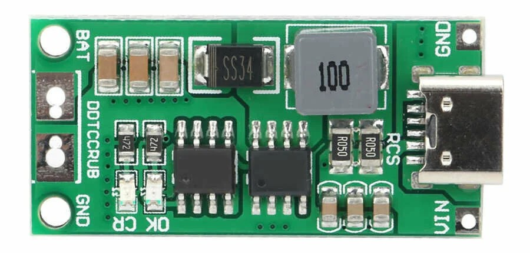
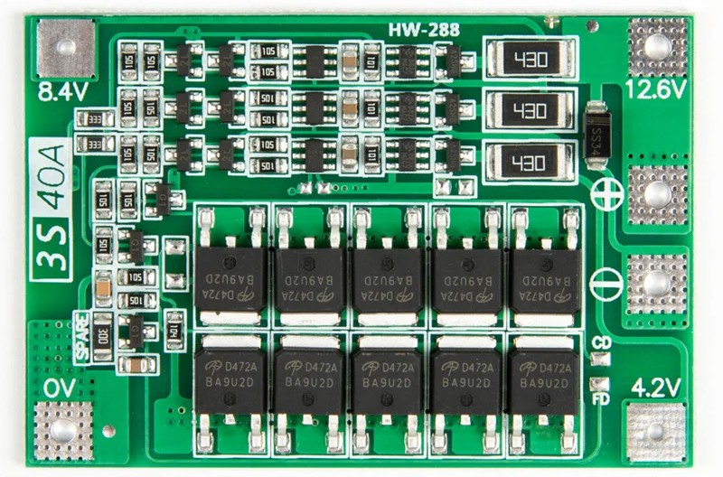
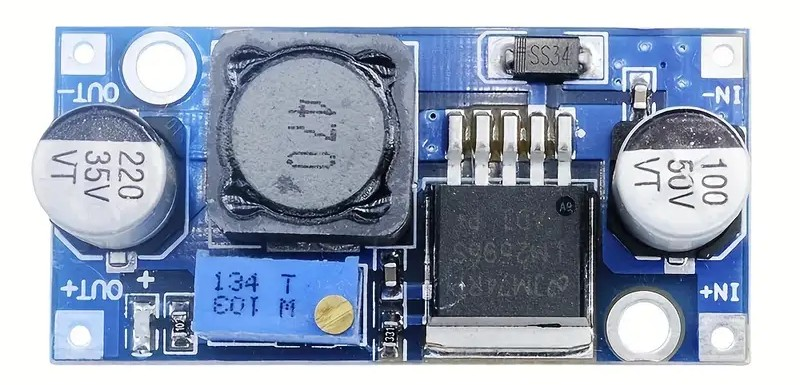
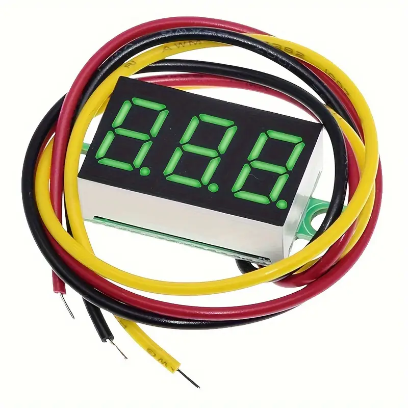
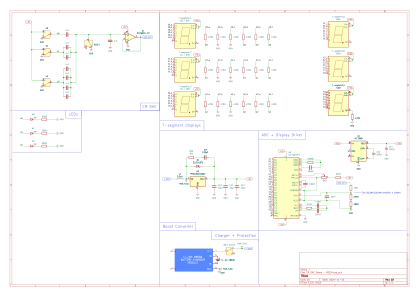
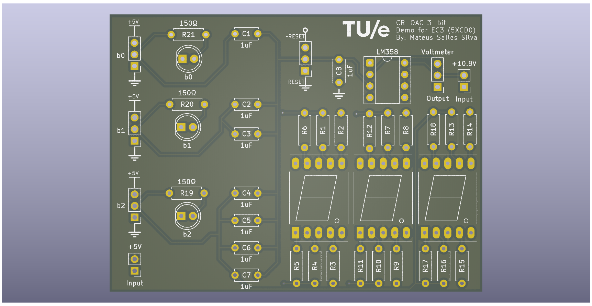
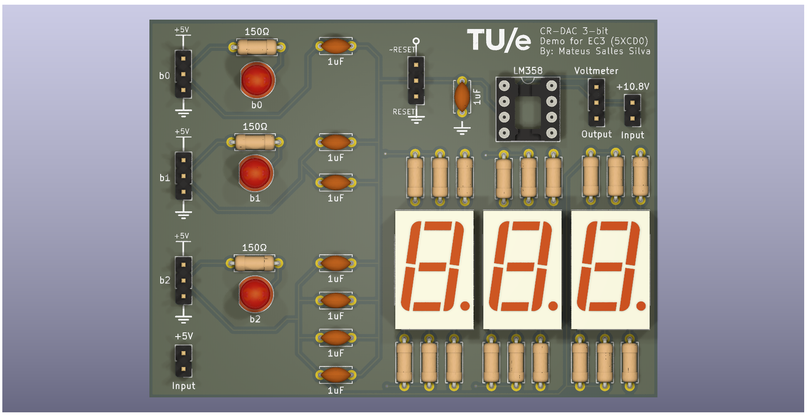

# Description
3bit charge redistribution digital-to-analog converter demonstration.  
Uses mechanical switches to manually change the digital input code.  
LED displays to show the input and output.
  
**Features**:
* LED displays showing binary input code and output.
* Battery-powered and rechargarable through USB-C  

# R02 Checklist
**Power Supply**:
Lower complexity + More compact
- [X] Scrapped +10.6V source → everything on the board is powered by 5V now
- [X] 3 Li-ion 18650 batteries → 1 Li-ion 18650 battery

**External Modules**:
2/4 modules scrapped + remaining 2 simplified
- [ ] Voltmeter module → in-board voltmeter [own design w/ SMD components]
- [ ] Buck-converter module → in-board boost-converter (3.6V to 5V) [own design w/ SMD components]
- [ ] 3s BMS → 1s BMS
- [ ] 3s USB-C charger → 1s USB-C charger

**Components**:
- [X] LM358 → MCP6001 rail-to-rail input/output (RRIO)
- [X] THT → SMD for all components except DAC capacitors (for demonstration purposes)

**PCB**:
- [ ] New PCB design required to accommodate new changes

# Power
**Current Consumption**:  
MAX Current Consumption (ignoring neglegible current from ICs):
* Node LEDs: 3 x 10mA = 30mA
* 7-segment - INPUT: 6 x 3 x 8mA = 144mA
* 7-segment - OUTPUT: 6 x 3 x 8mA + 8mA from DP = 152mA
* TOTAL: 326mA  

  Assuming 90% efficiency from boost converter: Pout = Pin*0.9  
  Vin = 3.6V (nominal battery voltage)

 326mA * 5V = 3.6V * I_battery * 0.9  
=> I_battery = 503.1mA  
Total battery capacity: 2500mAh  
=> Time with 1 full charge = 2500mAh / 503.1mA = 4.97h ≈ 5h  

# External Modules
## I/O's
### 1. INPUT: +10.8V DC
Source: 3 [Li-on 18650](https://www.nkon.nl/lithplus-l1865-2-5p30-2500mah-20a-reclaimed.html) batteries with USB-C charging (BMS + charging module)  

Powers the...
* OP-AMP Buffer -> needs headroom to be able to buffer FSR correctely, +6V (about 1V of headroom) should be enough according to simulation and testing
* Voltmeter module -> low input voltages will cause higher innacuracy and considerably dimmer display

### 2. INPUT: +5V DC
Source: Buck converter -> steps down voltage from batteries (10.8V) to a stable 5V  

Powers the...
* DAC input rails
* LED's to indicate the ON/OFF state of each bit/input node
* Three 7-segment displays for visualising the input code

### 3. OUTPUT: Voltmeter module
Used to display the output voltage of the DAC

## List of All Modules
These are all the external modules used in this project:
1. [3S Lithium charger module with USB-C](https://www.otronic.nl/nl/3s-lithium-lader-module-met-usb-c.html)  
  
  
2. [BMS 3S Protection circuit with balancing function](https://www.otronic.nl/nl/bms-3s-protectiecircuit-met-balanseer-functie.html)  
  

3. [Adjustable DC Buck converter](https://www.temu.com/goods.html?_bg_fs=1&goods_id=601099688899521&sku_id=17592865467398&_x_sessn_id=xhurdah5rs&refer_page_name=bgt_order_detail&refer_page_id=10045_1760898173474_43uv4ga00o&refer_page_sn=10045&is_back=1) (does not have do be adjustable as long as it has a 5V output)  
  

4. [Mini Voltmeter (3-wire) module](https://www.temu.com/goods.html?_bg_fs=1&goods_id=601099579419326&sku_id=17592461540786&_x_sessn_id=xhurdah5rs&refer_page_name=bgt_order_detail&refer_page_id=10045_1760898537078_7040q3hsyi&refer_page_sn=10045&is_back=1&no_cache_id=1pw6t)
  
  
# Schematic
Schematic files:
* [KiCad](https://github.com/mathebaka/3bit-CR-DAC-DEMO/blob/main/KiCad%20files.zip)
* [Multisim](https://github.com/mathebaka/3bit-CR-DAC-DEMO/blob/main/Multisim-simulation.ms14)

# PCB
PCB files:
* [KiCad Project](https://github.com/mathebaka/3bit-CR-DAC-DEMO/blob/main/KiCad%20files.zip)
* [Gerber files](https://github.com/mathebaka/3bit-CR-DAC-DEMO/blob/main/gerber.zip)

No components (bare):

With components (switches replaced with connectors):

# Case
