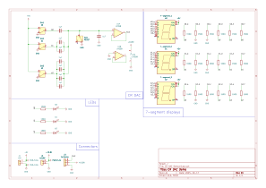

# Description
3bit charge redistribution digital-to-analog converter demonstration.  
Uses mechanical switches to manually change the digital input code.  
LED displays to show the input and output.
  
**Features**:
* LED displays showing binary input code and output.
* Battery-powered (1 18650 Li-ion) and rechargarable through micro-USB 

# R02 Checklist
**Power Supply**:
Lower complexity + More compact
- [X] Scrapped +10.6V source → everything on the board is powered by 5V now
- [X] 3 Li-ion 18650 batteries → 1 Li-ion 18650 battery

**External Modules**:
3 external modules → 1 external module
- [X] Voltmeter module → in-board voltmeter [own design w/ SMD components]
- [X] Buck-converter module → in-board boost-converter (3.6V to 5V) [own design w/ SMD components]
- [X] 3s BMS & 3s USB-C charger → 1s USB-C charger with protection

**Components**:
- [X] LM358 → MCP6001 rail-to-rail input/output (RRIO)
- [X] THT → SMD for all components except DAC capacitors (for demonstration purposes)

**PCB**:
- [X] New PCB design required to accommodate new changes

**FINAL CHANGES**:
- [X] Round corners
- [X] More easter eggs

**README**:
- [ ] BOMs

# Current Consumption
MAX Current Consumption (ignoring neglegible current from ICs):
* Node LEDs: 3 x 10mA = 30mA
* 7-segment - INPUT: 6 x 3 x 8mA = 144mA
* 7-segment - OUTPUT: 6 x 3 x 8mA + 8mA from DP = 152mA
* TOTAL: 326mA  

Assuming 90% efficiency from boost converter → Pout = Pin*0.9  
Vin → Nominal battery voltage = 3.6V  
  
Pout = Pin * 0.9  
326mA * 5V = 3.6V * I_battery * 0.9  
→ I_battery = 503.1mA  

Total battery capacity: 2500mAh  
=> Time with 1 full charge = 2500mAh / 503.1mA = 4.97h ≈ 5h  

# Internal Modules
Internal modules are sub-circuits within the PCB.
## Boost Converter 3.6V→5V
The TPS61322A IC was used in this module, the design is based off the second example in the [data sheet](https://www.ti.com/lit/ds/symlink/tps61322.pdf).
  
* L1 = 2.2μH
* C1 = 10μF || 10μF || 10μF = 30μF
* D1: ZLLS410TA
* R1 = 5 Ohms
* C2 = 120pF

## Voltmeter Module
Centered around the [ICL7107](https://www.renesas.com/en/document/dst/icl7106-icl7107-icl7107s-datasheet?srsltid=AfmBOoq9oAzdzCN0QF71E_OcAmB2YEBGpXoNf32Zm5NzRzv7xGBHOHWO) chip, which is a dual-slope ADC with built-in 7-segment LED display driver circuitry. The circuit I built is the first example in their data sheet, the only difference is the added voltage divider for converting the DACs output to the max allowed input of the ICL7107 of 200mV; the specific values were chosen in order to main COUNT=500 at 5V, and Vref=100mV (from data sheet example).

# External Modules
Only one external module was used in release 2. 
## Li-ion Charger w/ Protection
TP4056 Micro-USB Li-ion charger 1A with Li-ion protection circuit ([link](https://www.tinytronics.nl/en/power/bms-and-chargers/li-ion-and-li-po/with-protection-circuit/tp4056-micro-usb-li-ion-charger-1a-with-li-ion-protection-circuit))
### Specifications:
* Charging current: 1A (maximum)
* Maximum charging voltage: 4.2V (1.5% accuracy)
* Input voltage: 4.5V-5.5V
* Two LED's indicating the status of charging (LED above R2 indicates charging, LED above R1 indicates when the battery is charged)

### Protection:
* over-discharge: >3A (too high current)
* under-discharge: <2.5V (too low voltage)
* Short-circuit?
* No temperature monitoring
  

# Schematic
Schematic files [OUTDATED / R01]:
* [KiCad](https://github.com/mathebaka/3bit-CR-DAC-DEMO/blob/main/KiCad%20files.zip)
* [Multisim](https://github.com/mathebaka/3bit-CR-DAC-DEMO/blob/main/Multisim-simulation.ms14)

# PCB
PCB files:
* [KiCad Project](https://github.com/mathebaka/3bit-CR-DAC-DEMO/blob/main/KiCad%20files.zip)
* [Gerber files](https://github.com/mathebaka/3bit-CR-DAC-DEMO/blob/main/gerber.zip)

No components (bare):

With components (switches replaced with connectors):

